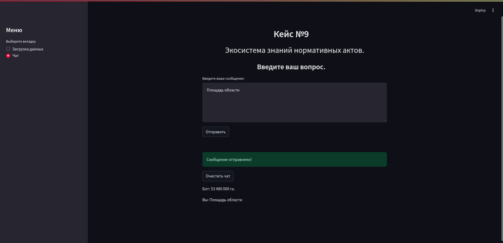

# AI Product Hackathon Fall 2024

# LegalHelper. Экосистема знаний нормативных актов

В этом репозитории лежит исходный код для решения задачи Югорского НИИ информационных технологий.  

## Проблема

Законотворцы ХМАО тратят много времени на актуализацию знаний по существующим НПА. Делать это критически важно, но пока выходит ресурсозатратно.

## Решение 

ИИ-чат-бот, который будет выдавать релевантный и фактически верный ответ из базы знаний НПА.

## Цель на AI Product Hack 

Создать MVP ИИ-чат-бота, который ускорит актуализацию знаний по существующим НПА законотворцами ХМАО на 20% до 14 сентября 2024 г

### На что обращали внимание?

После небольшого брейншторминга мы пришли к выводу, что решение должно отвечать следующим критериям:

- **Масштабируемость**. Обработка больших объемов данных
- **Гибкость**. Адаптация под разные сценарии использования
- **Точность**. Высокая точность анализа и предсказаний
- **Простота**. Легкость интеграции с существующими системами

## Что умеет LegalHelper? 

- извлекать нужную информацию по запросу

## Что планируется в будущем?

- Генерация проектов документов;

- Поиск противоречий и коллизий между документами; 

- Учет зависимостей между нормативно-правовыми актами;

- Шаблоны по заполнению официальных документов, отчетов, докладов


### Данные

Данные были предоставлены Югорским НИИ информационных технологий. В них входили:

1. Датасет НПА
2. Датасет Вопросов/Чанков/Ответов

#### Каждый из датасетов включает в себя:
- вопрос по НПА; 
- контекст по данному вопросу из НПА; 
- эталонный ответ LLM; 
- тип_вопроса (служебная метка).

### Архитектура. 

#### Naive RAG vs. SELF- RAG


Классический Naive RAG - революционное для своего времени решение, однако и оно имеет весомые недостатки:

- **Проблемы с поиском** — это приводит к выборке несогласованных или нерелевантных фрагментов и отсутствию важной информации.
- **Проблемы с генерацией** — модель может сталкиваться с галлюцинациями и иметь проблемы с актуальностью, токсичностью или предвзятостью в своих выходных данных, что может сделать ответы менее надежными и качественными.

Мы решили использовать паттерн Self-RAG. Он позволяет повысить качество генерации LLM. Увеличивает фактическую точность без ущерба для универсальности за счет поиска по запросу и саморефлексии.

#### RAGAS. Метрики

Оценивать работу нашего RAG будем с помощью фреймворка RAGAS. Мы выбрали следующие метрики: 

Для ответа:

- **Faithfulness** - позволяет оценить фактическую согласованность сгенерированного ответа с заданным контекстом. Рассчитывается на основе ответа и извлеченного контекста. 
 - **Answer Correctness** -  включает в себя два важных аспекта: семантическое сходство между сгенерированным ответом и эталонным ответом, а также фактическое сходство.


Для контекста:


- **Context Precision** - показатель, который оценивает, все ли релевантные элементы, присутствующие в контекстах, имеют более высокий рейтинг или нет. В идеале все релевантные фрагменты должны располагаться на верхних строчках рейтинга.
- **Context Recall** - измеряет степень соответствия извлеченного контекста аннотированному ответу, который рассматривается как эталонный ответ.
- **Context utilization** - оценивает, все ли элементы, относящиеся к ответу, присутствующие в контекстах, имеют более высокий рейтинг или нет. Схожа с Context Precision.  

### Frontend/Backend

Frontend представляет собой веб-приложение на Streamlit.
Backend реализован на Python с использованием FastAPI. 


### Инструменты

- **Модели**. Yandex GPT Pro, USER
- **Язык программирования**. Python
- **Библиотеки**. LangChain, ragas
- **Хранилища данных**. Векторные базы данных (Milvus)
- **Веб-фреймворк**. FastAPI, Streamlit

### Описание репозитория

- `data/` - данные, на которых раг работает.
- `docker/` - Frontend/Backend сервисы с Docker файлами, `docker-compose.yml
- `experiments/` - Jupyter ноутбуки с реализациями экспериментов и идей для хакатона
- `readme/` - директория для хранения доп. материалов этого Readme файла.

### Сборка и запуск приложения

Для реализации сценария будут использоваться сервисы Yandex Cloud.

- [YandexGPT](https://yandex.cloud/ru/docs/foundation-models/concepts/yandexgpt/) - большая языковая модель для построения embedding-ов по документам и ответов на вопросы.
- [Yandex Object Storage](https://yandex.cloud/ru/docs/storage/) - Объектное хранилище, в котором изначально хранятся файлы с базой знаний.
- [Yandex DataSphere](https://yandex.cloud/ru/docs/datasphere/) - Cервис для обучения ML-моделей и среда разработки на Python для взаимодействия с YandexGPT и OpenSearch.

Работа с векторной БД и языковой моделью YandexGPT осуществляется с помощью популярного фреймворка с открытым исходным кодом [LangChain](https://www.langchain.com/).

Существует 2 способа общения с чат-ботом:

- Пользовательский интерфейс чат-бота, написанный на Streamlit. На момент написания необходимо разворачивать тяжелый докер под него. 

`docker compose -f docker-compose.yml up --build` (из `docker/` директории)

Интерфейс станет доступен по [ссылке](http://localhost:8501).



- API к чат-боту, написанное на FastAPI. Для использования API необходимо сделать запрос. Пример запроса через request:

```python

import requests

# Define the URL of the FastAPI application
url = " http://localhost:8000/rag/query"

# Create the payload with the query
payload = {
    "query": "Чем обновлять школы округа?"
}

# Send the POST request
response = requests.post(url, json=payload)

# Check the response status code
if response.status_code == 200:
    # If the request was successful, print the response data
    print("Response:", response.json())
else:
    # If there was an error, print the status code and error message
    print("Error:", response.status_code, response.text)
```

Формат ответа: {answer : text, context : text}. Образец:

```json
{
  "answer": "Учебно-наглядные пособия и оборудованные кабинеты.",
  "contexts": [
    "по оснащению образовательного процесса, реализованные за период 2007 - 2010 гг.: более 30% школьников автономного округа обучаются в условиях, не соответствующих современным требованиям; больше половины образовательных учреждений автономного округа нуждаются в обновлении учебно-наглядных пособий, современных оборудованных кабинетах. образовательные учреждения автономного округа обеспечены доступом к сети интернет, однако в большинстве учреждений отсутствуют локальные внутренние сети, необходимые для', 'для перевозки обучающихся 0,000 0,000 0,000 3 пополнение фондов библиотек общеобразовательных учреждений 80,732 80,732 0,0 4 развитие школьной инфраструктуры (текущий ремонт с целью обеспечения выполнения требований к санитарно- бытовым условиям и охране здоровья обучающихся, а также с целью подготовки помещений для установки оборудования) 0,000 0,000 0,000 5 повышение квалификации, профессиональная переподготовка руководителей общеобразовательных учреждений и учителей * 0,000 0,000 0,000 6 модернизация"
  ]
}
```

## Результат

Что получилось в итоге? Наш прекрасный бот - ассистент законотворца ХМАО! 

Задать вопрос нашему генеративному эксперту можно [тут](http://localhost:8501)

## Ссылки

- [RAGAS](https://docs.ragas.io/en/latest/concepts/metrics/context_utilization.html)
- [Self-RAG](https://arxiv.org/abs/2310.11511)
- [Обзор и адаптация средств оценки RAG-систем под русский язык](ttps://youtube/VcOLsc1MUTY?t=768)
- [USER](https://huggingface.co/deepvk/USER-bge-m3)
